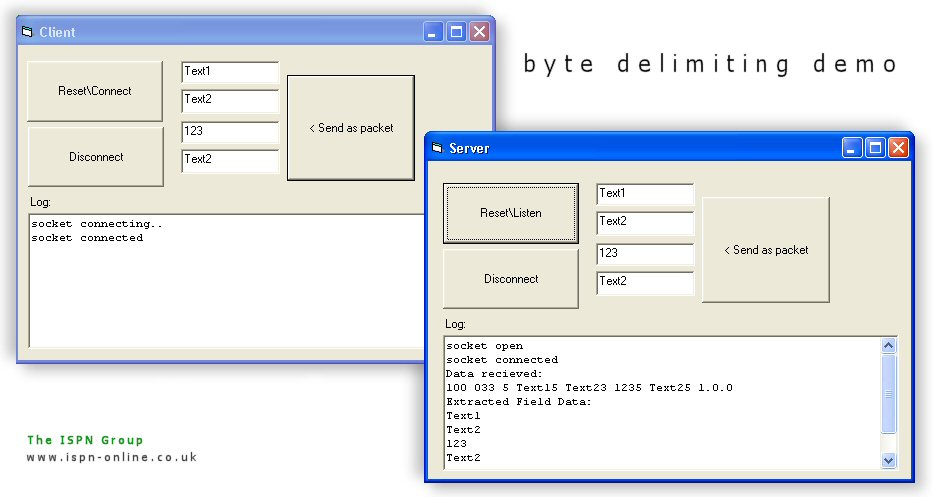



## \[ Advanced Data Delimiting \(Byte Delimiting\)

### Description

Use this method with Winsock. Ever had it when you need to send lots of data all at once, and you need individual structured fields for each commands? Does your field data contain special characters or binary data? Conventional methods of delimiting packets simply won’t allow you to get away with that. This code demonstrates how to use Byte Level Delimiting (as I have dubbed it, anyway), and also shows how to buffer incoming and outgoing data, so you can handle large data flawlessly. There is a word document inside the ZIP archive that explains the principle and mechanics of the idea, and also code to demonstrate it. Also uses protocol compression, if the compressed size is smaller than the decompressed size (ZLIB). Feedback greatly appreciated, thank you.
 
### More Info
 

             |
---                |---
**Submitted On**   |2003-09-02 17:02:34
**By**             |[ByteForce UK](https://github.com/Planet-Source-Code/PSCIndex/blob/master/ByAuthor/byteforce-uk.md)
**Level**          |Advanced
**User Rating**    |4.5 (18 globes from 4 users)
**Compatibility**  |VB 5\.0, VB 6\.0
**Category**       |[String Manipulation](https://github.com/Planet-Source-Code/PSCIndex/blob/master/ByCategory/string-manipulation__1-5.md)
**World**          |[Visual Basic](https://github.com/Planet-Source-Code/PSCIndex/blob/master/ByWorld/visual-basic.md)
**Archive File**   |[Advanced\_D163965922003\.zip](https://github.com/Planet-Source-Code/byteforce-uk-advanced-data-delimiting-byte-delimiting__1-48178/archive/master.zip)

